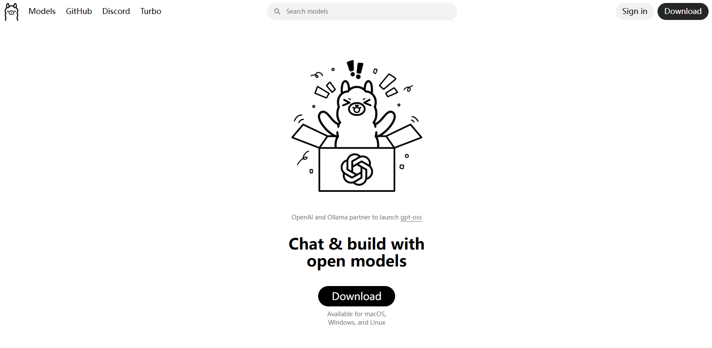
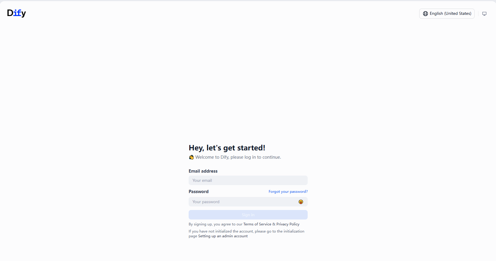
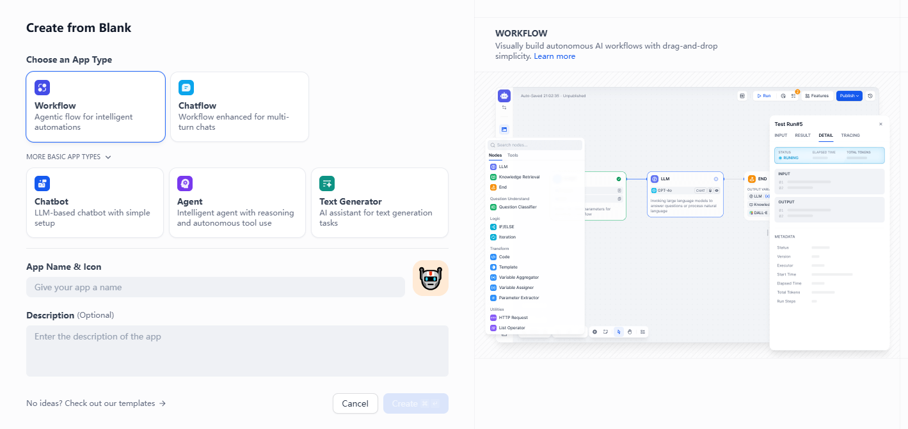

# Project backgroud

In this project, we will utilize the most popular and the highest Github starts tools to build Agentic AI solutions，where the two famous tools are Dify and Ollama respectively.

* Dify: Dify is an open‑source, low‑code platform for building, deploying, and managing AI‑native applications—especially those powered by Large Language 
Models (LLMs). Think of it as a “codeless LLM‑Ops” layer that lets product teams, data scientists, and developers go from a prompt to a production‑grade AI service in minutes, while still giving power‑users full control over the underlying code and infrastructure.
Dify offers everything you need — agentic workflows, RAG pipelines, integrations, and observability — all in one place, putting AI power into your hands.

ps: The founder of Dify is an ex-Tencent employee.

* Ollama: Ollama is a lightweight, cross‑platform runtime that lets you download, manage, and run large language models (LLMs) locally on a laptop, workstation, or on‑prem server – no cloud API keys required. Brings the power of GPT‑style models into 
environments where data‑privacy, latency, or cost make remote inference impractical.

# Step1 Deploy Dify 

Before installing Dify, make sure your machine meets the following minimum system requirements:

CPU >= 2 Core
RAM >= 4 GiB

The easiest way to start the Dify server is through Docker Compose. Before running Dify with the following commands, make sure that Docker and Docker Compose are installed on your machine:

git clone XXXX
modify .env file
docker compose up -d

The web ui of Dify:

The agent management page:

Create an App Type including Workflow, ChatFlow, Chatbot, Agent, Text Generator.

# Step2 Deploy Ollama

 ​curl -fsSL https://ollama.com/install.sh | sh

 all the listed LLM models on the website
 

 This time, we use Deepseek-r1:1.5b model. The size of this model is 1.1GB
 

 Ollama -help commands and the models already pulled:
 

 An example of QA with Deepseek model:
 

 

# Step3 Connect Ollama models to Dify and Build AI Apps

In Dify settings， Ollama locally running model could be added to the platform:

Both Hunyuan and Deepseek models have been added:

## Two AI apps built with Dify:

### Intelligent Translator

This app is a translator, and it could translate Chinese to English and French simulatenously.
The app is fullfilled by prompt engineering.

### Travel assist
This app is a travel assist, and it could make a travel plan under your specific demand including destination, days and budget.

The configuration mode of the app in Dify. Prompt words could be setted and tune functions and responses.

The demo QA of this app:

Q: generate a travel plan for Sydney including beautiful oceans and delicious food.

A: (the answer could be seen from above images, and the plan generated by AI is fantastic)

# Conclusion

Dify and Ollama are currently highly popular projects and applications in the AI field, helping you quickly build your own AI-native applications. There is no doubt that AI is the future, and it will continue to transform our society and daily lives.