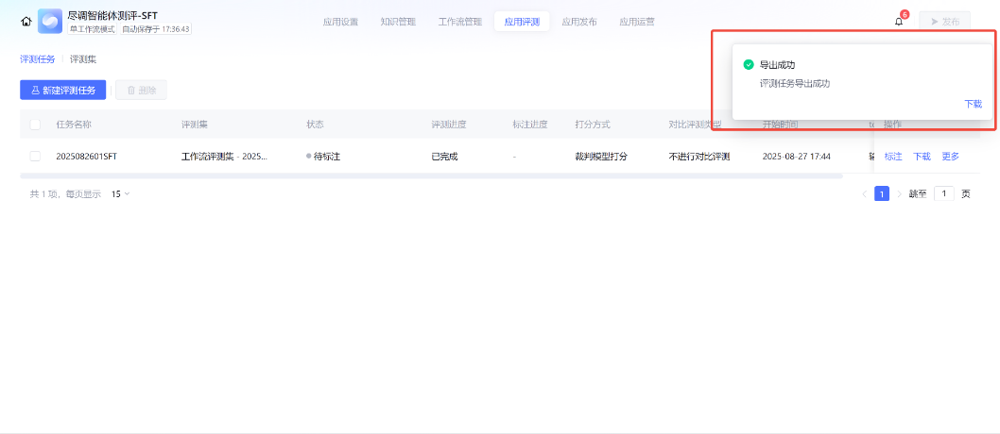

# Project background

Tencent Cloud's Ti Platform is a one-stop platform for large model and computing power management, training, and inference. 

Tencent Cloud's ADP Platform is an intelligent agent development platform that enables low-code agent building. 

This project utilizes GPU servers, the Ti Platform, and the ADP Platform to construct a "Financial Report Analysis Assistant" agent, incorporating processes such as large model integration, secondary fine-tuning, model deployment, and workflow configuration.

Services related：

# Step1 Deploy LLM Model and run a service on Ti-platform

Select "Model Square", and ensure that the region is the same as that of the previously activated GPU instances and CFS.
Use the internal Model Qwen3 series/ Qwen3-4B.
resources needed：
GPU: L20 * 0.5 card

This is the demo of the running service:

# Step2 Build an agent on ADP platform
It is easy for ADP to call the model deployed on TIONE: 

Select the base model from ADP platform

For knowledge management, ADP supports Mysql DB as a resources for knowledge:

Workflow layout for the application:

We can observe the process of workflow at tunning mode. The agent cloud extract the key information from pdf format financial report, and automatically insert the information into Mysql DB using the sql scripts generated by LLM model.

workflow process:

data inserted into DB:

# Step3 Fine-tunning of Model with special training data

Start a job to fine-tun the base model. The training data is stored in COS bucket.

When the fine-tunning job is completed, the new model artifact will be outputed to file system CFS.
In Ti platform we can start a new service using the new model artifact from file system.

# Step4 Compare the performance of different models

Launch Evaluation Task

The average score of new model is higher.

score of fine-tunning model

score of original model

# Conclusion

Through all these products in Tencent Cloud and this specific task, we cloud become familiar with the entire closed-loop process of large model deployment, training, agent development and debugging, model fine-tuning, and model evaluation.